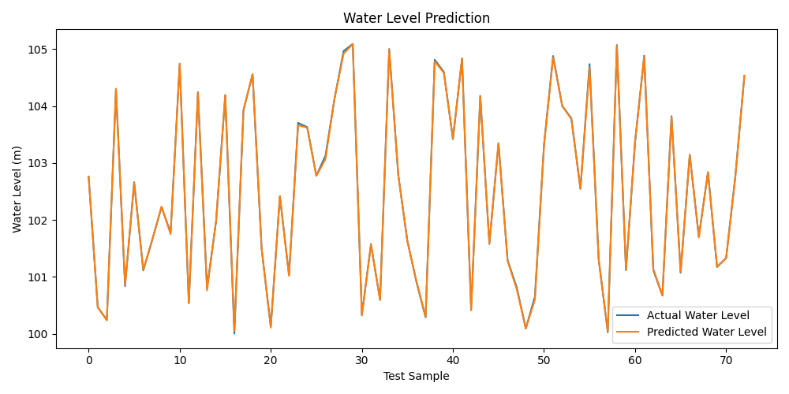

# Reservoir Data Analysis with Machine Learning

This project demonstrates how machine learning can be applied to reservoir data for optimizing water resource management or energy production forecasting. A synthetic time-series dataset is used to model water level prediction based on environmental and inflow/outflow features.

## 📁 Project Structure

```
reservoir-ml-analysis/
├── data/
│   └── synthetic_reservoir_data.csv
├── src/
│   ├── preprocess.py          # Feature engineering and preprocessing
│   ├── train_model.py         # Model training and evaluation
│   ├── visualize.py           # Plotting model results
├── main.py                    # Entry point to run the pipeline
├── requirements.txt           # Project dependencies
└── README.md
```

## 🚀 Features

- Time-series data preprocessing with Pandas and NumPy
- Feature engineering for reservoir inflow/outflow behavior
- Random Forest regression to forecast reservoir water levels
- Model performance visualization using Matplotlib

## 📊 Sample Output

The model predicts water level over time, producing a plot like this:



## 🛠️ Installation & Setup

1. **Clone the repository**  
   ```bash
   git clone https://github.com/yourusername/reservoir-ml-analysis.git
   cd reservoir-ml-analysis
   ```

2. **Create a virtual environment (optional but recommended)**  
   ```bash
   python -m venv venv
   source venv/bin/activate   # or venv\Scripts\activate on Windows
   ```

3. **Install dependencies**  
   ```bash
   pip install -r requirements.txt
   ```

4. **Run the project**  
   ```bash
   python main.py
   ```

## 🧠 Technologies Used

- Python
- Pandas & NumPy
- Scikit-learn
- Matplotlib
- Joblib

## 📌 Outcome

The project provides actionable insights into reservoir behavior using predictive modeling, demonstrating key data science capabilities in handling time-series data, regression modeling, and visualization.

---

Feel free to fork and adapt this project for real datasets or integrate with IoT sensor streams!
